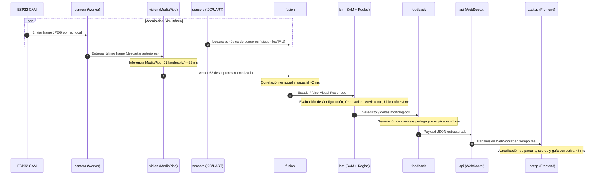
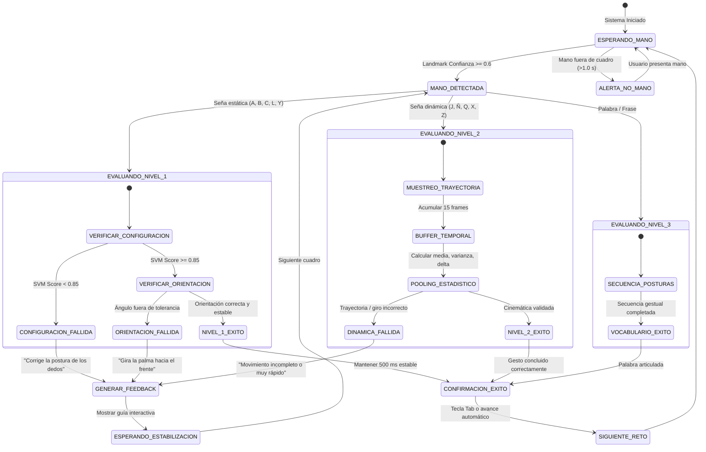

# Flujo de Datos del Sistema — INDIVISA INGENIUM 2026

**Documento:** [`03_DOCS/architecture/DATA_FLOW.md`](file:///C:/Users/migue/Downloads/SALLE/INDIVISA_INGENIUM_2026/03_DOCS/architecture/DATA_FLOW.md)  
**Proyecto:** Sistema Mecatrónico y Visión Artificial para Retroalimentación de LSM en Tiempo Real  
**Documento Complementario:** [`SOFTWARE_ARCHITECTURE.md`](file:///C:/Users/migue/Downloads/SALLE/INDIVISA_INGENIUM_2026/03_DOCS/architecture/SOFTWARE_ARCHITECTURE.md)  
**Marco de Control:** Sujeto a las Reglas Obligatorias de [`AGENTS.md`](file:///C:/Users/migue/Downloads/SALLE/INDIVISA_INGENIUM_2026/AGENTS.md).

---

## 1. Diagrama de Flujo de Datos Global

```mermaid
flowchart TD
    subgraph ESP32_CAM["ESP32-CAM (Adquisición Visual)"]
        SensorOV["Sensor OV2640"] -->|DMA Frame| CamDriver["esp_camera Driver"]
        CamDriver -->|JPEG Encode| HTTPServer["HTTP MJPEG Server / Socket"]
    end

    subgraph HW_SENSORS["Instrumentación Mecatrónica"]
        FlexSensors["Sensores de Flexión / Contacto"] --> ADC_IMU["Acondicionamiento / IMU"]
        ADC_IMU -->|Bus I2C / UART| SensorBus["Línea de Datos Físicos"]
    end

    subgraph RPI5["Raspberry Pi 5 (Procesamiento Central)"]
        HTTPServer -->|Stream Wi-Fi Local| FrameConsumer["camera: Threaded Consumer (Buffer=1)"]
        SensorBus -->|50 Hz Polling| SensorReader["sensors: Adquisición y Filtro"]

        FrameConsumer -->|Frame BGR Fresco| VisionPipe["vision: MediaPipe Hands (ARM64)"]
        VisionPipe -->|21 Landmarks (63 coords)| Normalizer["Normalización respecto a P0 y P9"]
        
        SensorReader -->|Telemetría Física| FusionEngine["fusion: Motor de Fusión Sensorial"]
        Normalizer -->|Landmarks Normalizados| FusionEngine
        
        FusionEngine -->|Estado Fusionado Unificado| LSMEval["lsm: Evaluador Lingüístico 4 Parámetros"]
        
        subgraph EVAL_PARAMS["Parámetros LSM Evaluados"]
            LSMEval --> Param1["1. Configuración (Queirema) - SVM RBF"]
            LSMEval --> Param2["2. Orientación - Normal de Palma + IMU"]
            LSMEval --> Param3["3. Movimiento (Kinema) - Pooling Temporal"]
            LSMEval --> Param4["4. Ubicación (Toponema) - Coordenadas Espaciales"]
        end
        
        Param1 & Param2 & Param3 & Param4 --> DecisionAggregator["Agregador de Decisión Multicriterio"]
        DecisionAggregator --> FeedbackEngine["feedback: Motor de Corrección Explicable"]
        
        FeedbackEngine --> API_Server["api: FastAPI WebSocket Server"]
        FrameConsumer -.->|Overlay Gráfico| API_Server
    end

    subgraph LAPTOP_UI["Laptop ASUS (Estación de Visualización)"]
        API_Server -->|JSON Telemetría + Video WS| BrowserClient["frontend: Interfaz Web Reactiva"]
        KeyboardInput["Teclado de Laptop (A, B, C, L, Y, Space, R)"] -->|Eventos de Control| BrowserClient
        BrowserClient -->|Comandos de Selección / Calibración| API_Server
    end
```

---

## 2. Diagrama de Secuencia Temporal por Ciclo de Frame (50 ms / 20 FPS)



---

## 3. Máquina de Estados de Validación de Señas (Nivel 1, 2 y 3)



---

## 4. Descripción Detallada Paso a Paso de las Transformaciones de Datos

### Paso 1: Ingesta de Video y Descompresión
- **Origen:** Sensor OV2640 en ESP32-CAM.
- **Formato:** Flujo MJPEG sobre HTTP (`GET /stream`), resolución QVGA ($320 \times 240$) o CIF ($400 \times 296$) a 20 FPS.
- **Transformación:** El consumidor multihilo de la RPi 5 lee el flujo de bytes, detecta los delimitadores de inicio y fin de imagen JPEG (`0xFF 0xD8` y `0xFF 0xD9`), decodifica mediante `cv2.imdecode` a una matriz NumPy BGR de tamaño $(240, 320, 3)$ y actualiza la variable atómica de memoria compartida, sobreescribiendo frames previos no procesados.

### Paso 2: Extracción y Normalización de Landmarks (MediaPipe)
- **Transformación de Color:** BGR a RGB.
- **Inferencia:** MediaPipe Hands genera un conjunto de 21 landmarks tridimensionales normalizados en el rango $[0.0, 1.0]$ respecto al ancho y alto del cuadro.
- **Normalización Invariante a Escala y Traslación:**
  1. *Traslación:* Para cada landmark $i \in [0, 20]$, se resta la coordenada del landmark de la muñeca (landmark 0):
     $$\vec{P}'_i = \vec{P}_i - \vec{P}_0$$
  2. *Escala:* Se calcula la distancia euclidiana de referencia $D_{ref} = \|\vec{P}_9 - \vec{P}_0\|$ (distancia de la muñeca al nudillo del dedo medio).
  3. *Normalización final:*
     $$\vec{P}''_i = \frac{\vec{P}'_i}{D_{ref}}$$
  El resultado es un vector numérico plano de 63 dimensiones ($21 \times 3$), independiente de qué tan cerca o lejos esté la mano de la cámara.

### Paso 3: Ingesta y Filtrado de Sensores Físicos
- **Origen:** Circuito electrónico de sensores (flexión / IMU) conectado a pines I2C o UART.
- **Muestreo:** Bucle asíncrono a 50 Hz.
- **Acondicionamiento:**
  - Sensores de flexión: Conversión ADC de 12 bits a resistencia normalizada de curvatura $C_j \in [0.0, 1.0]$. Filtro de media móvil sobre 5 muestras.
  - IMU: Fusión de acelerómetro y giróscopo para estimar ángulos de inclinación (Roll, Pitch, Yaw de la mano) en grados sexagesimales.

### Paso 4: Sincronización y Fusión Sensorial
- Se busca en el búfer circular de telemetría física la muestra más cercana al timestamp del cuadro de video ($|\Delta t| < 20$ ms).
- Se ensambla el objeto `FusedSignState`, que integra:
  - Vector visual de 63 elementos.
  - Estado binario/analógico de flexión por dedo.
  - Orientación angular inercial de la mano.

### Paso 5: Evaluación Lingüística Jerárquica (LSM)
Se aplican las reglas correspondientes al nivel de la seña evaluada:

#### Nivel 1: Señas Estáticas (`A`, `B`, `C`, `L`, `Y`)
1. **Configuración:** Inferencia con clasificador SVM con kernel RBF preentrenado (`LSM-MediaPipe-SVM-main`). Retorna clase predicha y vector de probabilidad/distancia al hiperplano.
2. **Orientación:** Se calcula el vector normal de la palma a partir del producto cruz entre el vector muñeca-nudillo índice y muñeca-nudillo meñique:
   $$\vec{N} = (\vec{P}_5 - \vec{P}_0) \times (\vec{P}_{17} - \vec{P}_0)$$
   Se compara el ángulo de $\vec{N}$ respecto al eje óptico de la cámara y se corrobora con la lectura IMU.
   - *Seña 'A':* Puño cerrado, pulgar vertical apoyado lateralmente en el índice, palma al frente.
   - *Seña 'B':* Cuatro dedos extendidos y unidos, pulgar flexionado sobre la palma, palma al frente.
   - *Seña 'C':* Mano semicerrada formando una letra C lateral.
   - *Seña 'L':* Pulgar e índice extendidos a 90°, demás dedos flexionados.
   - *Seña 'Y':* Pulgar y meñique extendidos, dedos medio, anular e índice flexionados.

#### Nivel 2: Señas Dinámicas / Giro (`J`, `Ñ`, `Q`, `X`, `Z`)
- Se activa el búfer temporal de pooling estadístico (15 frames $\approx 750$ ms).
- Se computa:
  - Media de posición de landmarks: $\mu_x, \mu_y$.
  - Desviación estándar (amplitud del movimiento): $\sigma_x, \sigma_y$.
  - Vector de desplazamiento neto: $\Delta \vec{P} = \vec{P}_{final} - \vec{P}_{inicial}$.
  - Derivada angular (giro de muñeca para la seña 'Ñ' o trazado de la 'J' y 'Z').

#### Nivel 3: Frases y Vocabulario Compuesto (`HOLA`, `GRACIAS`, `POR FAVOR`, `AYUDA`, `MAMÁ`)
- Autómata de estados finitos que valida la secuencia temporal de posturas intermedias y ubicación respecto al cuerpo.

### Paso 6: Motor de Feedback y Generación Explicable
- Si el score global es inferior al umbral ($< 0.80$), el motor compara los sub-scores paramétricos:
  - ¿Falló Configuración? $\to$ Genera indicación del dedo discordante (ejemplo: *"Extiende completamente el meñique para la seña Y"*).
  - ¿Falló Orientación? $\to$ Genera indicación espacial (ejemplo: *"Gira la muñeca para que la palma mire al frente"*).
  - ¿Falló Movimiento? $\to$ Genera indicación de dinámica (ejemplo: *"Traza la forma de la letra Z de izquierda a derecha"*).
- Si todos los parámetros cumplen el criterio durante al menos 10 frames consecutivos (500 ms de estabilidad), se emite estado `SUCCESS`.

### Paso 7: Difusión de Telemetría a la Interfaz
- El orquestador serializa el estado en JSON estructurado.
- El servidor FastAPI emite el paquete vía WebSocket a la Laptop ASUS a través de la red local.

### Paso 8: Entrada de Teclado y Control desde la Laptop
- El usuario en la laptop interactúa con el teclado:
  - Presionar tecla `A`, `B`, `C`, `L` o `Y`: Envía comando instantáneo vía WebSocket hacia la RPi 5 para conmutar la seña objetivo.
  - Presionar tecla `Space`: Pausa la evaluación para congelar el diagnóstico y analizar la postura con calma.
  - Presionar tecla `R`: Ejecuta un comando de tara / calibración cero de los sensores físicos.
- La RPi 5 actualiza su variable de estado `target_sign` en caliente sin reiniciar servicios ni perder la conexión de video.
